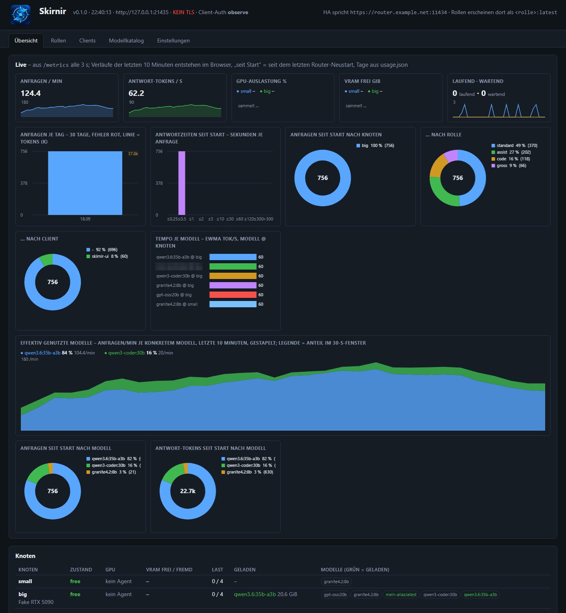

# Skirnir – rollen- und zustandsbewusster Router für Ollama

**Deutsch** · [English](README.md)


Skirnir steht vor einer oder mehreren Ollama-Installationen auf GPU-Rechnern und verhält sich gegenüber seinen Clients wie
**ein** Ollama-Server. Clients fragen nicht nach einem konkreten Modell, sondern nach einer **Rolle** (`standard:latest`,
`gross:latest`, `code:latest` …); der Router wählt pro Anfrage Knoten, Modell und Kontextgrösse – nach dem, was gerade
geladen ist, ob die GPU von einem Spiel belegt wird, wie viel VRAM frei ist, wie schnell und wie fehlerfrei ein Modell auf
einem Knoten zuletzt war. Die Ollama-API bleibt unverändert, dazu kommt eine OpenAI-kompatible Schnittstelle unter `/v1`.

Gebaut für ein Homelab: Home Assistant, Node-RED und lokale Agenten-Frameworks als Clients, Windows-Gaming-PCs als GPU-Knoten,
die nicht rund um die Uhr laufen und nicht nur der KI gehören. Der Name: Skirnir ist in der nordischen Mythologie Freyrs Bote,
der in fremde Reiche reitet, dort verhandelt und mit der Antwort zurückkehrt.

**Stand:** Version 0.1.0 (erstes Release), seit September 2026 in einem Homelab im Dauerbetrieb, ein Entwickler. Keine
Stabilitätszusagen; diese README gibt es auf Englisch und Deutsch, die Unter-READMEs (Agent, Decision Engine) sind deutsch. Wer es nachbaut, sollte Python, systemd und Ollama kennen.

## Was Skirnir kann

- **Rollen statt Modellnamen.** Eine Rolle ist eine Rangliste von Stufen (`Modell @ num_ctx`, optional `busy_ok`). Der Router
  nimmt die beste Stufe, die ein Knoten jetzt bedienen kann; ein schon geladenes Modell gewinnt („warm zuerst“).
- **Mehrere GPU-Knoten**, Windows oder Linux, angebunden über einen kleinen **Agenten** (Go), der einen ausgehenden Tunnel zum
  Router hält. Kein offener Port am Knoten, kein Zertifikat, keine feste IP. Wake-on-LAN für schlafende Knoten.
- **Busy-Erkennung.** Belegt ein Spiel die GPU (fremdes VRAM, Auslastung), laufen dort nur noch `busy_ok`-Stufen; grosse Modelle
  werden entladen und nach dem Spielen wieder vorgewärmt.
- **Scheduler** mit Score (warm, Last, VRAM, Tempo, Fehlerrate), Circuit Breaker je Knoten und **Admission Control** mit
  Prioritäten und Deadline im Router statt in Ollamas eigener Schlange.
- **Der Client beschreibt, der Router entscheidet:** ein optionaler `routing`-Block im Request nennt Pflicht-Fähigkeiten
  (`tools`, `vision`, `thinking`, `structured` …), Mindestkontext, Priorität, Sitzung, Datenklasse.
- **Auto-Rolle** `auto:latest`: eine Kette lokaler Entscheidungs-Engines (Embedding-Modell auf CPU, kleines LLM, TF-IDF, Regeln)
  wählt die Rolle aus dem Text der Anfrage. Gemessen 93 bis 98 % Treffer.
- **Cloud als Stufe.** OpenAI- und Anthropic-Modelle können als letzte (oder erste) Stufe in Rollen liegen, mit Datenklassen,
  Credential-Scan, Monatsbudget in CHF und Egress-Allowlist. Standardmässig geht nichts in die Cloud.
- **Client-Identitäten** auf dem Inferenz-Port (Bearer, Basic, Quell-IP), Rollen- und Modellsperren, Rate Limit, Audit-Log.
- **Beobachtbar:** Prometheus-Endpunkt, Nutzung je Tag und Client, Entscheidungsprotokoll, Home-Assistant-Gerät per MQTT-Discovery,
  Web-UI mit Live-Grafiken, Katalog, Rollen-Editor, Probierfeld und Lasttest.
- **Betriebsfest:** Config-Schema mit Vorschlägen bei Tippfehlern, Idempotency-Key, Canary- und Shadow-Stufen je Rolle,
  Deploy-Manifest mit SHA-256, Ollama-Versionen und Modell-Digests je Knoten.
- **TLS überall**, ein Prozess, ein Event-Loop, keine Datenbank. Abhängigkeiten: `aiohttp`, `pyyaml`, `cryptography`,
  optional `paho-mqtt` und `uvloop`.

## Architektur

```
  Clients: Home Assistant · Node-RED · OpenAI-kompatible Werkzeuge · Agenten-Frameworks
      │  https :11434   Ollama-API (/api/*) und OpenAI-API (/v1/*), Client-Identität
      ▼
 ┌────────────────────────── Skirnir (Debian-Container, Python 3.11, aiohttp) ──────────────────────────┐
 │  Rollen & Stufen · Scheduler · Admission · Decision Engine · Cloud-Stufen · Metriken · Usage · Audit │
 │  Web-UI und /admin/*  https :11435 (Basic Auth)              MQTT-Discovery ─────▶ Home Assistant     │
 └───────────────▲──────────────────────────────────▲──────────────────────────────────────────────────┘
                 │ wss /v1/tunnel (Agent → Router,   │ https
                 │ Ed25519-Schlüssel, Multiplex)      │
   ┌─────────────┴──────────────┐         ┌──────────┴───────────┐
   │ GPU-Knoten (Windows/Linux) │  …      │ Cloud-Anbieter       │
   │ Agent (Go) ◀▶ Ollama       │         │ OpenAI · Anthropic   │
   └────────────────────────────┘         └──────────────────────┘
```

Der Router pollt jeden Knoten alle 5 s (`/api/tags`, `/api/ps`), der Agent meldet alle 2 s GPU-Auslastung und VRAM. Aus beidem
entsteht je Knoten der Zustand `offline` / `free` / `busy`. Alle Ollama-Aufrufe des Routers laufen durch den Tunnel des Agenten;
Ollama selbst bleibt auf `localhost`.

## Schnittstellen

| Port | Was | Wer |
|---|---|---|
| **11434** | Ollama-API: `GET /api/tags`, `/api/ps`, `/api/version`, `POST /api/show`; Inferenz `POST /api/chat`, `/api/generate`, `/api/embed`, `/api/embeddings` (Streaming wird durchgereicht, `model` in der Antwort trägt den Rollennamen). `/api/pull`, `push`, `create`, `copy`, `delete` → 403. TLS mit dem eigenen Zertifikat (`api_tls`). | Clients |
| **11434 `/v1`** | OpenAI-kompatibel: `GET /v1/models`, `POST /v1/chat/completions` (SSE-Streaming, `tools`, `response_format`), `/v1/completions`, `/v1/embeddings`. Der Router übersetzt selbst nach `/api/chat`, damit Rollen, Kontextstufen und `keep_alive` gelten – Ollamas eigenes `/v1` kennt weder `num_ctx` noch `keep_alive`. | OpenAI-Clients |
| **11435** | Web-UI (`/`), `GET /admin/state`, `GET/PUT /admin/config`, `POST /admin/try`, `/admin/loadtest`, `/admin/measure`, `/admin/bench`, `/admin/decide`, `GET /admin/decision`, `/admin/usage`, `/admin/ha`, `/admin/nodes`, `/admin/clients`, `GET /metrics`. Basic Auth (PBKDF2-Hashes in der Konfiguration, geprüftes Paar 10 min gecacht). | Browser, Skripte, Prometheus |
| **11435 `/v1/tunnel`** | WebSocket vom Agenten: Anmeldung mit Ed25519-Signatur auf eine Challenge, Heartbeat, Konfigurationspaket, alle Ollama-Aufrufe als multiplexte Streams (REQ/RESP/DATA/END/ERR/CANCEL). | Agent → Router |
| MQTT 8883 | Discovery und Zustände für Home Assistant (TLS, Passwort aus `secrets.env`). | Router → Broker |

Anfragen dürfen 600 s dauern (`request_timeout_s`). Bricht der Client ab, schliesst der Router die Upstream-Antwort, der Tunnel
schickt CANCEL, der Agent beendet die Ollama-Anfrage.

## Rollen und Stufen

```yaml
roles:
  standard:
    exposed_as: standard:latest
    priority: normal                      # interactive | normal | batch (Admission)
    tiers:
      - { model: qwen3.6:35b-a3b, num_ctx: 65536 }
      - { model: qwen3.6:35b-a3b, num_ctx: 32768 }
      - { model: gemma4:12b,      num_ctx: 65536 }            # Ausweichstufe auf dem zweiten Knoten
      - { model: granite4.2:8b,   num_ctx: 32768, busy_ok: true }   # darf auf einer spielenden GPU laufen
  assist:
    priority: interactive
    tiers: [...]
```

- **Rangliste = Qualitätsobergrenze und Kaltstart-Reihenfolge.** Ist ein Listenmodell auf irgendeinem Knoten schon geladen,
  gewinnt es (unter mehreren warmen das ranghöchste). Global `modes.warm_first`, je Rolle `latency_first`.
- **Kontextleiter.** Dasselbe Modell mit kleinerem `num_ctx` ist die nächste Stufe, wenn der Kontext nicht ins VRAM passt.
  Passt-Prüfung: `VRAM-Bedarf = Gewichte + Kontext-Kosten × num_ctx/1000 + 0,8 GiB`. Gewichte und Kontext-Kosten je Modell
  stehen im Katalog (`models:`), gemessen per UI-Knopf **Messen** (lädt bei 8k und 32k, liest `/api/ps`) oder geschätzt.
- **Busy.** Ein Knoten ist `busy`, wenn fremdes VRAM (belegt − Ollama − Desktop-Grundverbrauch) über der Schwelle liegt oder die
  GPU ohne Router-Anfragen ausgelastet ist. Dann laufen nur `busy_ok`-Stufen; nicht-`busy_ok`-Modelle werden alle 30 s entladen.
  Der Desktop-Grundverbrauch wird je Knoten gelernt (Median der Stundenmittel bei ruhiger GPU) und durch einen Policy-Wert gedeckelt.
- **Prewarm.** Nach dem Online-Gehen und nach `busy → free` lädt der Router die Rang-1-Modelle der Rollen wieder vor, so viele
  zusammen ins VRAM passen. Eine **Residenz-Regel** holt ein verdrängtes Rang-1-Modell zurück, wenn der Verdränger 5 min nicht
  mehr gefragt wurde – sonst bliebe „warm zuerst“ dauerhaft auf der Ausweichstufe hängen.
- **Konkrete Modelle** (`qwen3-coder:30b`) sind weiter direkt aufrufbar (`expose_concrete_models`) und gehen 1:1 an einen Knoten,
  der sie hat; sonst 404 wie bei Ollama.
- **Canary** (`roles.<r>.canary: {model, num_ctx, percent}`) leitet einen Anteil des Verkehrs auf einen Kandidaten, auch kalt.
  **Shadow** (`roles.<r>.shadow`) wiederholt einen Anteil der Anfragen nach der Antwort ohne Stream gegen ein zweites Modell auf
  einem freien Knoten; der Client merkt nichts, Tempo und Fehlerrate landen in der Statistik.

Rollen, Katalog und die meisten Laufzeit-Einstellungen sind in der UI editierbar; die UI schreibt eine Override-Datei
`roles.yaml` neben die `config.yaml`, die Deploys überlebt. Ports, TLS, Basic-Auth, Identitäten, Anbieter-Endpunkte und
Egress-Allowlist bleiben bewusst Deploy-Sache.

## Der Client beschreibt, der Router entscheidet

Jeder Inferenz-Request darf einen `routing`-Block tragen. Ollama sieht ihn nie.

```json
{"model": "standard:latest", "messages": [...],
 "routing": {"require": ["tools"], "prefer": ["thinking"], "min_context": 32768,
             "priority": "interactive", "session_id": "unterhaltung-17",
             "data_class": "internal", "execution": "auto", "request_id": "ha-4711"}}
```

| Feld | Wirkung |
|---|---|
| `require` | Pflicht-Fähigkeiten (`tools`, `vision`, `thinking`, `structured`, `embedding`, `insert`, `completion`). Stufen ohne sie fallen weg; kann keine Stufe der Rolle, kommt **400** mit Klartext. |
| `prefer` | Wunsch: gibt es Stufen mit diesen Fähigkeiten, kommen nur sie in Frage, sonst wird der Wunsch ignoriert. |
| `min_context` | Untergrenze für den Kontext der Stufe. |
| `priority` | `interactive` < `normal` < `batch` für die Admission; sonst gilt die Rolle, gekappt durch das Client-Maximum. |
| `deadline_ms` | maximale Wartezeit in der Warteschlange, danach 503 mit Klartext. |
| `session_id` | Affinität: dieselbe Sitzung bleibt auf ihrem warmen Knoten (`session_affinity_ttl_s`, 30 min). |
| `data_class`, `execution` | Datenklasse (`personal` < `internal` < `public`) und `auto` / `local` / `cloud` für die Cloud-Stufen (unten). |
| `idempotency_key` | oder Header `Idempotency-Key`: Wiederholungen ohne Stream liefern dieselbe Antwort (`X-Skirnir-Idempotent-Replay: 1`). |
| `request_id` | wird in Antwort, Header und Protokoll gespiegelt; sonst `X-Request-Id` oder vergeben (`skirnir-…`). |

Auch ohne Block liest der Router den Request: `tools` → tools, Bilder → vision, `think: true` → thinking, `format` → structured,
`suffix` → insert. Fähigkeiten stammen aus Ollamas `/api/show`, ergänzt um Katalog-Overrides (`models.<name>.capabilities:
{structured: false}` für Modelle, die ein Schema mit HTTP 500 quittieren). Unbekannte Fähigkeiten blockieren nie.

Die Antwort trägt immer die Header `X-Skirnir-Request-Id`, `-Node`, `-Model`, `-Tier`, `-Warm`. Der Block `routing` im Body
(Knoten, Modell, Stufe, `reason`, `skipped` mit Grund je übersprungener Stufe, `candidates` mit Score, `queued_ms`, `decision`)
kommt nur, wenn der Client selbst einen `routing`-Block geschickt hat – Altclients sehen einen unveränderten Body. Bei `/v1`
steht er im `chat.completion` bzw. im letzten SSE-Chunk.

Grössenlimits vor dem Backend (413): `max_images` 16, `max_tools` 128, `max_messages` 1000, Body 64 MiB.

## Scheduler, Circuit Breaker, Admission

- **Score** unter den Kandidaten einer Stufe: warm +100, je laufende Anfrage −10, voller Knoten −50, freies VRAM (Anteil) ×2,
  Gewicht ×1, Tempo (EWMA tok/s / 100) ×2, Fehlerrate der letzten 20 Ergebnisse ×20, Breaker-Probe −5. Gewichte in
  `scheduler.score`, UI-editierbar.
- **Statistik je `model@node`:** Mittel der letzten 20 warmen Läufe und EWMA (α 0,3) für tok/s und Zeit bis zum ersten Token,
  Ergebnisse ok / error / timeout / structured_error. Persistiert in `perf.json`.
- **Circuit Breaker je Knoten:** drei Backend-Fehler in 60 s → `open` (30 s), dann `half_open` mit genau einer Probe. Ein
  Neustart des Knotens setzt ihn zurück. Retry auf einen anderen Knoten bei Verbindungsfehler oder 5xx vor dem ersten Byte.
- **Admission:** höchstens `max_inflight` gleichzeitige Anfragen je Knoten (Policy im Register, Vorgabe 2 – sollte
  `OLLAMA_NUM_PARALLEL` des Knotens entsprechen). Weitere warten im Router; beim Freiwerden gewinnt der beste Rang aus
  Prioritätsklasse und Alter (`aging_s` 30 s, damit Batch nicht verhungert). `max_queue` überschritten → 503 sofort.

## Auto-Rolle: die Decision Engine

Ein Client, der nicht weiss, welche Rolle passt, fragt `auto:latest`. Eine Kette von Engines wählt eine der konfigurierten
Rollen; unsicher (kleiner Abstand Platz 1/2, hohe Entropie, geringe Wahrscheinlichkeit) heisst: nächste Engine, am Ende `default`.
Entwurf: [design/decision-engine.md](design/decision-engine.md), Messreihe: [decision-eval/README.md](decision-eval/README.md).

| Engine | Was | Top-1 auf 132 ungesehenen Testfällen | Latenz | Wo |
|---|---|---|---|---|
| `embed` | `multilingual-e5-small` als ONNX int8 (113 MB) + Softmax-Kopf, eigener Container ([decision-embed/](decision-embed/)) | **0,932** | 10–19 ms | CPU, 4 Kerne, 456 MiB |
| `local_llm` | kleines Modell über den Router selbst mit erzwungenem JSON-Schema | **0,977** | ~200 ms warm | GPU-Knoten |
| `tfidf` | Zeichen-n-Gramme + Softmax-Regression, 570 KB JSON im Prozess ([decision-eval/train_tfidf.py](decision-eval/train_tfidf.py)) | 0,848 | < 1 ms | im Router |
| `rules` | Stichwörter, deterministisch, Kette-Ende | 0,523 | 0,1 ms | im Router |
| `jevlike` | [Jevlike](https://github.com/vinnylarouge/jevlike)-Adapter ([decision-jevlike/](decision-jevlike/)); gebaut, gemessen, für feste Rollen nicht lohnend | 0,750 | 15 ms | eigener Dienst |

Empfohlene Kette `[embed, local_llm, tfidf, rules]`: embed entscheidet in unter 20 ms, bei Unsicherheit (~6 % der Fälle) fragt
der Router das LLM, fällt der GPU-Knoten aus, greifen tfidf und rules. Routing-Genauigkeit der Kette 0,947; rein auf CPU
(`[embed, tfidf, rules]`) 0,909.

```yaml
decision_engine:
  enabled: true
  role: auto                                   # erscheint als auto:latest in /api/tags
  options: [standard, gross, assist, code]
  default: standard
  chain: [embed, local_llm, tfidf, rules]
  policy: { min_top_probability: 0.5, min_margin: 0.2, max_entropy_ratio: 0.75 }
  tfidf: { model_path: /etc/ollama-router/decision-tfidf.json }
  embed: { endpoint: http://127.0.0.1:8082, timeout_s: 2 }
  local_llm: { model: "assist:latest", timeout_s: 20, descriptions: { code: "Programmieren, Skripte, Fehlersuche", ... } }
  capture: { enabled: false, path: /var/lib/ollama-router/decisions.jsonl, clients: [], anonymize: true }
```

Das Ergebnis steht in `routing.decision` (Verteilung, Engine, Latenz, Unsicherheitsgründe, Fallback-Spur), in den Metriken
`skirnir_decision_*` und im Entscheidungsprotokoll. `POST /admin/decide` fragt eine Engine direkt, `GET /admin/decision` zeigt
Kette, Policy und Gesundheit. **Capture** schreibt Trainingsdaten (JSONL) nur für Clients im Opt-in, anonymisiert (Schlüssel,
E-Mail, IP, URL, lange Zahlen) und mit Gruppen-Hash; echte Rollenwahlen der Clients (`client`) bleiben von Engine-Pseudolabels
(`engine`) getrennt. Der Embedding-Kopf trainiert daraus in Sekunden neu; das Embedding-Modell bleibt.

## Client-Identitäten auf dem Inferenz-Port

`router.client_auth` kennt die Clients und führt sie in zwei Phasen ein: `mode: observe` bedient alles, zählt Unbekannte und
schreibt sie ins Audit-Log; `mode: enforce` antwortet ohne gültige Identität mit 401 (Ollama- oder OpenAI-Fehlerformat).
`/` und `/api/version` bleiben frei. `locked: true` verhindert, dass der Modus über UI oder API geändert wird.

Drei Wege, in dieser Reihenfolge: `Authorization: Bearer <token>` (so schickt die HA-Ollama-Integration ihren API-Key, OpenAI-
Clients ebenso), `Authorization: Basic <client>:<token>` und **Quell-IP** für Clients, die keinen Header senden können
(z. B. `node-red-contrib-ollama`, das seinen Key nur an ollama.com schickt). Ein falsches Token fällt nicht auf die IP zurück,
es zählt als `bad_token`. Tokens sind 256 Bit Zufall, gespeichert wird nur ihr **sha256** – die Prüfung läuft bei jeder Anfrage,
PBKDF2 wäre hier Selbstsabotage.

```yaml
client_auth:
  mode: enforce
  locked: true
  audit_log: /var/log/ollama-router/audit.jsonl
  clients:
    home-assistant: { token_sha256: "…", roles: ["*"], models: true, requests_per_minute: 120 }
    node-red:       { token_sha256: "…", ip: ["192.0.2.20"], roles: ["*"], models: true }
    batch-jobs:     { token_sha256: "…", roles: ["gross"], models: false, max_priority: batch, cloud: false, data_class: internal }
```

Je Client: `roles`, `models` (konkrete Modellnamen erlaubt?), `requests_per_minute` (429), `max_priority`, `cloud`, `data_class`.
Verstösse geben 403 und landen im Audit-Log (`auth_denied`, `bad_token`, `forbidden`, `rate_limited` – nie Prompts, nie Tokens).
Clients lassen sich auch in der UI anlegen; der Router erzeugt das Secret, zeigt den Klartext genau einmal und speichert den Hash
in `roles.yaml`. Der Knopf „Ausprobieren“ nutzt die interne Identität `skirnir-ui`, die nur von localhost gilt.

## Cloud als Stufe in Rollen

Cloud-Anbieter sind **Modelle im Katalog** (`"openai:gpt-5-mini": {cloud: openai, provider_model: gpt-5-mini, price_chf_per_m: {...}}`)
und liegen als Stufe in genau den Rollen, die es dürfen. Konkrete Cloud-Modellnamen sind nicht direkt aufrufbar (404), nur über
Rollen. Ein kaltes lokales Modell gewinnt vor der Cloud. Drei Fälle, in denen die Cloud zum Zug kommt: kein lokaler Knoten kann
(alle spielen oder aus), eine Fähigkeit fehlt lokal, oder der Client verlangt es (`routing.execution: cloud`).

Schranken (`router.cloud`):

- **Datenklassen als Deklaration**, kein Inhaltsklassifikator: `routing.data_class`, sonst `clients.<c>.data_class`, sonst
  `default_data_class` (**personal**). Cloud nur bis `max_cloud_data_class` (**internal**). Folge: wer nichts deklariert, geht nie
  in die Cloud.
- **Credential-Scan** (`block`): Prompts mit erkennbaren Schlüsseln (`sk-…`, `AKIA…`, `ghp_…`, JWT, `PRIVATE KEY`, `password: …`)
  gehen nicht in die Cloud; lokal laufen sie normal.
- **Budget** je Anbieter und Monat in CHF; erschöpft = Anbieter fällt als Stufe weg, ab `warn_at_percent` ein HA-Problem.
  Kosten je Anfrage in Usage und Metriken.
- **Egress-Allowlist** für `base_url` (+ `egress_allow`), Schlüssel nur aus `secrets.env`, nie im Log; Circuit Breaker wie bei
  Knoten; Schattenläufe gehen nie in die Cloud.

Adapter: `openai` (auch für OpenAI-kompatible Endpunkte) und `anthropic` (Messages-API). Beide übersetzen in das Ollama-Format,
danach gelten dieselben Wege wie bei Knoten.

## Observability

`GET /metrics` liefert Prometheus-Text ohne `prometheus_client`, Präfix `skirnir_`: `requests_total{role,node,model,client,via,outcome}`,
`tokens_total{kind,…}`, Histogramme `request_duration_seconds`, `ttft_seconds`, `queue_wait_seconds`, `events_total{event,node}`,
je Knoten `node_up`, `node_state`, `node_inflight`, `node_gpu_util_percent`, `node_vram_*_gib`, `node_breaker`, je Modell
`model_loaded_gib`, `perf_gen_tps`, `perf_error_rate`, dazu `decision_*`, `cloud_*`, `usage_today_*`, `info`.

```yaml
scrape_configs:
  - job_name: skirnir
    scheme: https
    metrics_path: /metrics
    basic_auth: { username: metrics, password_file: /etc/prometheus/skirnir.pass }
    static_configs: [{ targets: ["router.example.net:11435"] }]
```

`usage.json` führt 90 Tage lang je Tag und Client Anfragen, Tokens, Fehler und Cloud-Kosten (`GET /admin/usage`). Das
Entscheidungsprotokoll (`/admin/state`) hält die letzten Routen und Ereignisse (busy/free, WOL, Breaker, Warteschlange, Shadow,
Decision). `/admin/state` zeigt ausserdem `build` (Deploy-Manifest) und `supply_chain` (Ollama-Version und Modell-Digests je Knoten).

## Web-UI



*Übersicht in der lokalen Entwicklungsumgebung (`test/dev_env.py`) mit zwei Fake-Knoten und synthetischem Verkehr.*

Eine Seite ([router/ui.html](router/ui.html)), ohne externe Bibliotheken, fünf Tabs:

- **Übersicht:** Knoten mit Zustand, Breaker, GPU, VRAM, Last und geladenen Modellen; Cloud-Anbieter mit Budgetbalken;
  registrierte Agenten (Freigabe, Policy); Betriebskacheln; letzte Entscheidungen; **Live-Grafiken** (Canvas aus `/metrics`):
  Anfragen/min, Tokens/s, GPU und VRAM je Knoten, Tage-Verlauf, Latenz-Histogramm, Anteile nach Knoten/Rolle/Client, effektiv
  genutzte Modelle.
- **Rollen:** Stufen-Editor mit Priorität, Canary, Shadow; **Ausprobieren** (Rolle oder Modell, num_ctx, execution, Datenklasse,
  Priorität, think) mit Knoten, Stufe, Grund, übersprungenen Stufen, Dauer aufgeteilt in Warteschlange / Modell / Router; **Lasttest**
  (n Anfragen mit Parallelität c, dazu Sonden mit `interactive`).
- **Clients:** Karten je Client, Secret erzeugen und rotieren, Quell-IPs, Rollen, Limits.
- **Modellkatalog:** Gewichte, Kontext-Kosten, VRAM-Bedarf, Tempo, Fähigkeiten, Messen und Benchmark; Cloud-Modelle mit Preisen.
- **Einstellungen:** alles, was der Router zur Laufzeit liest (Allowlist in [settings.py](router/ollama_router/settings.py)),
  mit config.yaml-Wert, Markierung geänderter Werte und Rücksetzen.

Lokal ansehen ohne echte Knoten: `python test/dev_env.py` startet Fake-Knoten, Fake-Cloud, Fake-Agent und den Router ohne TLS
und Login auf `http://127.0.0.1:21435/`.

## Home Assistant

Der Router meldet sich per MQTT-Discovery als Gerät **Skirnir** an: Sensoren für Knoten online/belegt, verfügbare Modelle,
bereite Rollen (Attribut: welcher Knoten und welches Modell jetzt gewählt würde), Anfragen und Tokens heute, Cloud-Kosten
im Monat, letzte Zuweisung, je Knoten Zustand / GPU-Auslastung / freies VRAM, ein `binary_sensor` **Problem** mit Attribut
`problems` (kein Knoten online, Rolle nicht bedienbar, Agent schweigt, Budget-Warnung) und ein Sensor **Knoten wartet auf
Freigabe** für neue Agenten. Last-Will `ollama-router/status=offline`; fehlende Messwerte sind `unavailable`, nicht `unknown`.
Knoten-Entitäten werden nachgeführt: gesperrte oder gelöschte Knoten verschwinden aus HA, auch wenn sie während eines
Router-Neustarts verschwanden. Die HA-Ollama-Integration spricht den Router direkt (`https://router.example.net:11434`, API-Key =
Client-Token); Modell = Rolle.

## GPU-Knoten: der Agent

[agent-go/](agent-go/) enthält den Agenten als Windows-Dienst bzw. Linux-Binary (Go, eigenes README). Er

- baut den Tunnel zum Router (`wss://…:11435/v1/tunnel`) und hält ihn mit Backoff; ein Router-Neustart kostet 1–2 s,
- weist sich mit einem beim ersten Start erzeugten **Ed25519-Schlüssel** aus (Windows: DPAPI-geschützt); unbekannte Schlüssel
  warten im Router auf Freigabe (UI, HA-Sensor),
- meldet alle 2 s GPU-Auslastung und VRAM (NVML direkt, Rückfall `nvidia-smi`), Hostname, MAC, Versionen; seit Agent
  0.6.0 auch Temperatur, Leistung und Power-Limit, Lüfter, Drosselgründe und, wenn auf einem Windows-Knoten GPU-Z läuft,
  Speichertemperatur, Hot Spot, GPU-Spannung sowie Leistung und Spannung am 16-Pin-Stecker (alles im Knotenzustand des
  Routers und als Home-Assistant-Sensoren),
- bekommt nach der Freigabe sein **Konfigurationspaket** durch den Tunnel (Heartbeat-Takt, optional MQTT-Zugang) und braucht keine
  eigenen Secrets,
- kann **Ollama als Kind-Prozess** führen (`children:` in seiner Konfiguration), damit ein Knoten nach dem Reboot ohne Anmeldung
  bereit ist, und optional weitere Dienste beaufsichtigen,
- stellt optional einen TLS-Proxy vor Ollama (`ollama_proxy`, Port 11443, Zertifikat per Fingerprint gepinnt) für Router, die
  ohne Tunnel direkt zugreifen sollen.

Ein neuer GPU-Rechner braucht: Ollama mit Modellen, das Agent-Binary, eine Konfiguration mit `router.url` (Vorlage
[agent-go/config.example.yaml](agent-go/config.example.yaml)), `Install-Service.ps1` als Administrator, dann die Freigabe in der
Router-UI (Wake-on-LAN, Gewicht, MQTT-Gerät). Kein Token, keine Firewall-Regel, kein Zertifikat, keine IP von Hand.

## Installation des Routers

Voraussetzungen: Debian 12 (oder vergleichbar) mit Python 3.11, Pakete `python3-aiohttp`, `python3-yaml`, `python3-cryptography`;
`python3-paho-mqtt` für Home Assistant, `python3-uvloop` optional (unter Windows läuft der Router mit dem Standard-Event-Loop).
Ein TLS-Zertifikat für den Hostnamen des Routers (z. B. Let's Encrypt), auf den die Clients zugreifen.

1. `router/` nach `/opt/ollama-router/` kopieren (mit dem Paket `ollama_router/`).
2. [router/config.example.yaml](router/config.example.yaml) nach `/etc/ollama-router/config.yaml` (0600) und anpassen:
   `public_url`, Zertifikatspfade, Rollen, Katalog, Clients. Passwort-Hashes für die UI erzeugt
   `python3 router.py --hash '<passwort>'`; Client-Hashes sind `sha256` des Tokens.
3. Prüfen: `python3 router.py --check /etc/ollama-router/config.yaml` – meldet unbekannte Schlüssel mit Vorschlag.
4. systemd-Einheiten aus `router/` nach `/etc/systemd/system/`: `ollama-router.service` (läuft mit `ProtectSystem=strict`,
   schreibt nur `/etc/ollama-router` und sein Log-Verzeichnis), optional `ollama-router-cert.path` (Neustart bei erneuertem
   Zertifikat) und `ollama-router-secrets.*` (siehe 5). `systemctl enable --now ollama-router`.
5. Secrets: der Router liest `/etc/ollama-router/secrets.env` (`MQTT_PASSWORD`, `OPENAI_API_KEY`, `ANTHROPIC_API_KEY`). Die Datei
   kann von Hand gepflegt werden oder von `render-env.sh` aus einem Secret-Store gerendert werden (Universal-Auth-API)
   (Zugangsdaten in `/etc/ollama-router/render-env.conf`, Vorlage [router/render-env.conf.example](router/render-env.conf.example);
   täglicher Timer startet den Router bei geändertem Secret neu).
6. Für die Auto-Rolle: `decision-tfidf.json` nach `/etc/ollama-router/` und den Embedding-Container aus `decision-embed/` starten
   (`compose.yaml`, bindet nur `127.0.0.1:8082`). Beides ist optional; ohne sie bleibt `decision_engine.enabled: false`.
7. Agenten installieren und in der UI freigeben.

**Ausrollen von einer Arbeitsstation** (LXC): [deploy/deploy.py](deploy/deploy.py) kopiert Code, Konfiguration und
Einheiten per SFTP auf den LXC-Host, von dort per Datei-Push in den Container (Vorlagen `CT_EXEC`/`CT_PUSH`, Standard LXD), prüft die Konfiguration vor und nach dem
Push und startet den Dienst nur bei bestandener Prüfung neu. Alles Standortspezifische (Host, Container-Nummer, Produktiv-
`config.yaml`, Secret-Store-Zugang) liest es aus einem **Ops-Ordner ausserhalb des Repos**, siehe [deploy/ops_env.py](deploy/ops_env.py).
So kann das Repo öffentlich sein, ohne dass Hashes, IPs oder Hostnamen darin landen. Wer kein LXC-Host hat, kopiert von Hand
oder passt die zwei Vorlagen `CT_EXEC`/`CT_PUSH` in `deploy.env` an.

## Entwicklung und Tests

```bash
python test/run_tests.py          # 232 End-to-End-Prüfungen, ~3 min: zwei Fake-Ollama-Knoten, Fake-Agent durch den Tunnel,
                                  # Fake-Cloud (OpenAI und Anthropic), Fake-Decision-Dienst, selbstsigniertes TLS, Client-Auth,
                                  # Admission, Breaker, Canary/Shadow, Idempotency, Cloud-Schranken, UI-Config-Runden
python test/dev_env.py            # dieselbe Umgebung zum Klicken, ohne TLS/Login
python test/perf_run.py           # Messstand: CPU je Anfrage, py-spy-Profil (test/perf_profile_report.py)
ruff check .                      # Lint (ruff.toml: F, E9, B904, B905)
```

Gemessen ist der Router I/O-gebunden: rund 0,6 ms CPU je weitergeleiteter Anfrage im Messstand, etwa 10 ms je `/api/chat` in
Produktion gegenüber 200–300 ms im Modell. Ein Prozess mit einem Event-Loop reicht, weil die GPU-Knoten 2–4 Anfragen/s liefern
und die eigentliche Grenze `OLLAMA_NUM_PARALLEL` ist.

## Repo-Layout

| Pfad | Inhalt |
|---|---|
| `router/router.py`, `router/ollama_router/` | Dienst: `app`, `config` (Schema), `proxy` (Ollama-API), `openai_api`, `request` (routing-Block), `scheduler`, `admission`, `nodes`, `poll` (Zustandsautomat, Prewarm), `registry` (Agenten-Register), `tunnel`, `auth`, `cloud`, `decision/` (Engines), `metrics`, `perf`, `ops` (Idempotency, Canary, Shadow, Manifest), `ha` (MQTT), `admin`, `settings` (UI-Allowlist), `toolcall_rescue` (Tool-Calls, die Ollamas Parser als Text verliert, werden zurückgeholt), `wol` |
| `router/ui.html`, `router/skirnir.png`, `router/favicon.png` | Web-UI und Logo |
| `router/config.example.yaml`, `router/*.service`, `*.timer`, `*.path`, `render-env.sh`, `render-env.conf.example` | Beispielkonfiguration, systemd-Einheiten, Secrets-Renderer |
| `router/decision-tfidf.json` | trainiertes TF-IDF-Modell der Auto-Rolle |
| `agent-go/` | Agent für die GPU-Knoten (Go 1.27, Windows-Dienst / Linux-Binary), eigenes README |
| `agent/` | Vorgänger des Agenten als PowerShell-Task; nur noch Rückfallweg |
| `decision-eval/` | Datensatz-Generator (136 Vorlagen, 1282 Beispiele, Gruppen-Split), Trainer für TF-IDF und Jevlike, Auswertung (Top-1, Kalibrierung, Ketten), Ergebnisse |
| `decision-embed/` | Stufe 2 der Auto-Rolle: ONNX-Export, Kopf-Training, Dienst, Container |
| `decision-jevlike/` | Jevlike-Dienst (Prototyp, gemessen, nicht produktiv) |
| `deploy/` | `deploy.py`, `ops_env.py` |
| `design/` | Entwürfe: `routing-algorithm.md`, `roadmap.md` (Ausbaustufen und Entscheidungen), `decision-engine.md`; Logos (mit einem Bildmodell erzeugt, Metadaten entfernt) |
| `test/` | Testsuite, Fakes, Dev-Umgebung, Messstand |
| `tools/split_router.py` | einmaliges Werkzeug, das die frühere Einzeldatei über den Syntaxbaum in das Paket zerlegte |

## Sicherheitsmodell, kurz

- Alle Strecken TLS: Inferenz- und Admin-Port mit dem eigenen Zertifikat, Tunnel über WSS mit Ed25519-Challenge je Agent,
  MQTT über 8883. Ollama selbst hört nur auf localhost.
- Zwei Vertrauensstufen: der Inferenz-Port kennt Clients (Token-Hash oder IP), der Admin-Port verlangt Basic Auth mit PBKDF2.
- Was die Vertrauensbasis verschiebt (Ports, TLS, Identitäten, Anbieter-Endpunkte, Egress, `client_auth.mode` bei `locked`),
  ist nicht über UI oder API änderbar, nur über die Konfigurationsdatei.
- Secrets liegen in `secrets.env` (0600), erscheinen nie in Logs oder `/admin/state`; der Router hat keinen Schreibzugriff auf den
  Secret-Store.
- Prompts gehen nur mit deklarierter Datenklasse in die Cloud und nie mit erkennbaren Schlüsseln darin.
- Offen: der Dienst läuft als root (ein eigener Benutzer braucht Rechte auf Konfiguration, Log und Zertifikat).

## Messwerte als Anhaltspunkt

VRAM-Bedarf nach der Formel oben, gemessen auf einer RTX 5090 (31,8 GiB, KV-Cache f16, Ollama 0.33/0.34); Tempo aus dem
UI-Benchmark (200 Token, temperature 0, Median aus zwei Läufen, Kontext 8k).

| Modell | Gewichte GiB | Kontext-Kosten MiB/1k | VRAM @8k / @32k / @64k GiB | gen tok/s | prompt tok/s | Fähigkeiten |
|---|---|---|---|---|---|---|
| qwen3.6:35b-a3b | 20,6 | 1 | 21,4 / 21,4 / 21,5 | 254 | 1219 | vision, tools, thinking |
| qwen3-coder:30b | 17,3 | 98 | 18,9 / 21,2 / 24,2 | 285 | 5964 | tools |
| glm-4.7-flash | 17,7 | 50 | 18,9 / 20,1 / 21,7 | 224 | 10689 | tools, thinking |
| granite4.2:30b | 16,8 | 248 | 19,5 / 25,3 / 33,1 ✗ | 76 | 3478 | tools, thinking |
| gemma4:26b | 16,1 | 12 | 17,0 / 17,3 / 17,7 | 233 | 1822 | vision, tools, thinking |
| gpt-oss:20b | 12,0 | 2 | 12,8 / 12,8 / 12,9 | 270 | 6712 | tools, thinking (kein `structured`) |
| gemma4:12b (RTX 4080) | 7,8 | 2 | 8,6 / 8,6 / 8,7 | 71 | 1277 | vision, tools, thinking |
| granite4.2:8b | 5,0 | 162 | 7,0 / 10,8 / 15,9 | 213 | 7919 | tools, thinking |

Modelle mit hybrider Attention (qwen3.6, gemma4, gpt-oss) kosten pro Kontext-Token praktisch kein VRAM; granite und die
Coder-Modelle zahlen spürbar. Thinking-Modelle erzeugen ohne `think: false` unsichtbare Denk-Token – die Antwortdauer ist dann
kein Mass für das Tempo. Neu messen, wenn Ollama, Treiber oder KV-Cache-Typ wechseln.

## Grenzen und Nicht-Ziele

- Ein Router-Prozess, kein Cluster: geteilter Zustand (Warteschlange, Breaker, Register) liegt im Speicher und in JSON-Dateien.
- Kein Inhaltsklassifikator für Datenklassen, kein Modell-Signing über Ollamas Digests hinaus, kein OpenTelemetry.
- Die Busy-Erkennung kennt unter Windows kein prozessgenaues VRAM (WDDM liefert `N/A`); sie rechnet mit Summen und gelernten
  Baselines und hat dafür Nachlauf- und Anspruchs-Mechanik gegen Phantomwerte.
- `/v1/embeddings` braucht ein Embedding-Modell auf dem Knoten; Chat-Modelle antworten dort mit 501, das reicht der Router durch.
- Die Deploy-Skripte setzen LXC voraus.

## Lizenz

[MIT](LICENSE). Die Modelle, die Skirnir verteilt, und die eingebundenen Fremdprojekte (Jevlike, multilingual-e5-small,
Ollama) haben ihre eigenen Lizenzen.
